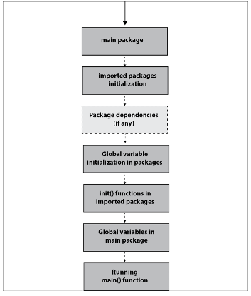

# Orden de lectura
1. [functions.go](functions.go)
2. [namedReturn.go](namedReturn.go)
3. [sorting.go](sorting.go)
4. [returnFunction.go](returnFunction.go)
5. [variadic.go](variadic.go)
6. [defer.go](defer.go)
7. [getSchema.go](getSchema.go)
8. [postGo.go](postGo.go)
9. [documents.go](./document/document.go)
# Mis propios scripts
- [m_sorting.go](m_sorting.go)
- [m_returnFunc.go](m_returnFunc.go)
- [packagesTest.go](packagesTest.go) => Checa go.mod y los directorios .\mpkg y .\mpkg2
- [m_pgDatabase.go](m_pgDatabase.go) => Detalles del conector de postgres básico de go. Lee los comentarios

# Tareas del capítulo (No haré las de phoneBook por el momento)
- [h1.go](h1.go)
- [h_getSchema.go](h_getSchema.go)
- No haré la conexión a MySQL porque tendría que ponerme a hacer otra vez toda la busqueda y levantar un servidor MySQL expuesto a internet, el resumen es cambiar el conector, en particular MySQL y Postgres se mueven parecido en Go
- No interesado en CI/CD de momento, quizás en otra ocasión.

# Una introducción a paquetes en Go (medio de locos esta cosa):

A ver, son las 4am y mi lenguaje formal ya no existe a esta hora y el libro no tiene muy buena explicación al respecto, Go cambió buena parte del sistema de paquetería en v1.16 y además jinetié medio Google tratando de entender para morir en manos de quién sabe que indio en youtube y depués un canal en español (gracias a este último hay un buen resumen) con [este video](https://www.youtube.com/watch?v=0CKT_2NXdgI)

Primero que todo tenemos que indicarle al compilador qué dependencias tenemos y de dónde sacarlas, es algo parecido al package.json de node. Para inicializar esto le tenemos que usar el comando ````go mod init [module-path]```` y a partir de ahí podemos empezar a jugar con los paquetes.

El sistema de paquetería de Go no me gusta mucho porque todo paquete que necesites vas a tener que almacenarlo localmente y la manera de cambiar tu ambiente de desarrollo (hasta donde sé) es ajustando tus variables de entorno para que GOPATH apunte a otro directorio, crear una especie de estructura de directorios... en serio da hueva... entonces podemos resumir que, paquete que te descargues (con dependencias incluidas), paquete que se queda en tu memoria y ¿Por qué razón? dicen los cerebritos que hicieron Go que así lo puedes reutilizar si lo vuelves a necesitar (se ve que estos tipos andan con presupuesto para almacenamiento), that's it...

Lo que nos interesa, traernos paquetes de afuera para que ocupen tu computador de hostal. Si ya tienes tu **go.mod** en el directorio de tu proyecto, podemos empezar a usar el comando ````go get -[opciones] <recurso>```` y el comportamiento default sin opciones va a ser meterlo en $GOPATH/pkg/mod/... (si te interesa puedes ver el código fuente), compilarlo y meterlo como referencia a tu **go.mod** y puede ser que se genere un archivo **go.sum**. Como en mi caso, se tarda unos segundos en refrescar todo el linting y puede que no lo logre incluso, reinicia tu editor/IDE. Ya con esto puede tirar código aprovechándote del trabajo y horas de sueño ajenas xD (se ve feo si se dice así jajaja).

Pero hay más!!! Tus propios paquetes, o piensas hacer un torta de código Go (con panuchos y coca incluida)? Para hacer tus propios paquetes solo crea un directorio con el nombre del paquete y tus próximas declaraciones de package en el código hazlas con el mismo nombre (no seas cavernícola Alejandro).

El resto del proceso es igual, vas a tener que todo lo que empieza con mayúscula en los paquetes es público y lo que no, es privado y solo funciona en ese paquete que se declaró. Metes todas tus referencias en un import y **Arre palmiche que están tocando adeguello!!!**

Unos pequeños recordatorios, échale un ojo a ````go mod tidy```` porque se suponne que ese utilidad revisa que modulo no usas y se los vuela, cuales tiene pero no encuentras y quizás hasta actualiza. Vale la pena echarle el ojo...

